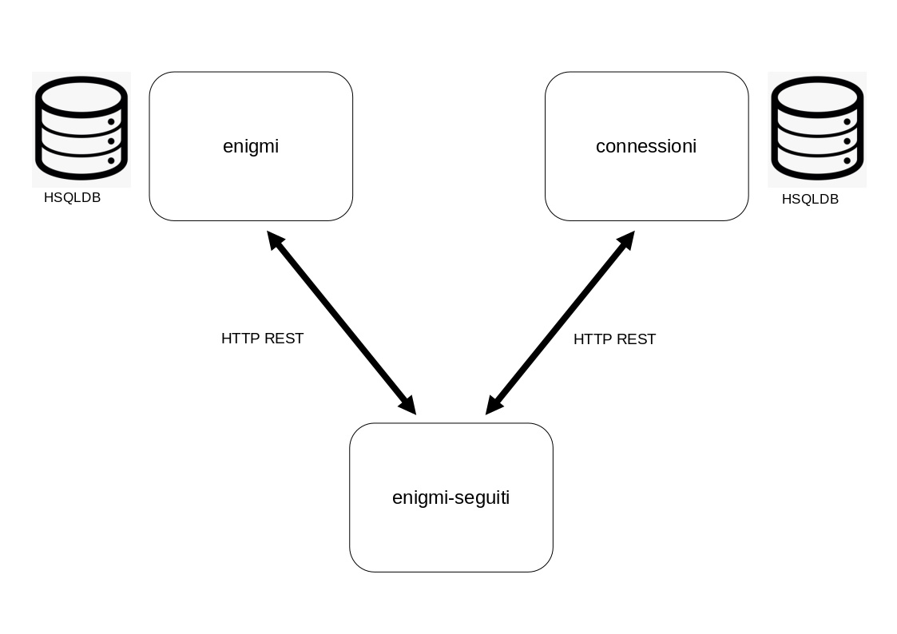

# SFINGEGRAM 

Progetto del corso di [Architettura dei Sistemi Software](http://cabibbo.inf.uniroma3.it/asw/) per l'anno accademico 2020-2021, Università Roma Tre.

## Descrizione di questo progetto 

Questo progetto contiene il il codice di *Sfingegram*, un semplice social network per la condivisione di enigmi (ovvero, giochi enigmistici). 
Gli utenti del sistema possono pubblicare degli enigmi. 
Possono poi seguire gli enigmi di specifici autori o di specifici tipi.  
Quando un utente accede alla pagina degli enigmi che segue, gli vengono mostrati gli enigmi degli autori e dei tipi che segue. 

L'applicazione *Sfingegram* è composta dai seguenti microservizi: 

* Il servizio *enigmi* gestisce gli enigmi. 
  Ogni enigma ha un autore, un tipo, un titolo, un testo (che può essere composta da più righe) e una soluzione (che può essere composta da più parole). 
  Operazioni: 
  * `POST /enigmi` aggiunge un nuovo enigma (dati autore, tipo, titolo, testo e soluzione)
  * `GET /enigmi/{id}` trova un enigma, dato l'id 
  * `GET /enigmi/{id}/soluzione` trova la soluzione di un enigma, dato l'id 
  * `GET /enigmi` trova tutti gli enigmi (senza la soluzione)
  * `GET /cercaenigmi/autore/{autore}` trova tutti gli enigmi di un certo autore (senza soluzione)
  * `GET //cercaenigmi/autori/{elenco-di-autori}` trova tutti gli enigmi di un insieme di autori (senza soluzione) 
  * `GET /cercaenigmi/tipo/{tipo}` trova tutti gli enigmi di un certo tipo (senza soluzione)
  * `GET /cercaenigmi/tipi/{elenco-di-tipi}` trova tutti gli enigmi di un insieme di tipi (senza soluzione)
  
* Il servizio *connessioni* gestisce le connessioni degli utenti, ovvero gli autori e i tipi di enigmi seguiti dagli utenti. 
  Le connessioni sono delle coppie utente-autore oppure utente-tipo, in cui gli autori sono in genere altri utenti del sistema. 
  Operazioni: 
  * `POST /connessioniconautori` aggiunge una nuova connessione utente-autore (dati utente e autore)
  * `GET /connessioniconautori` trova tutte le connessioni utente-autore
  * `GET /connessioniconautori/{utente}` trova tutte le connessioni utente-autore di un certo utente
  * `POST /connessionicontipi` aggiunge una nuova connessione utente-tipo (dati utente e tipo)
  * `GET /connessionicontipi` trova tutte le connessioni utente-tipo
  * `GET /connessionicontipi/{utente}` trova tutte le connessioni utente-tipo di un certo utente

* Il servizio *enigmi-seguiti* consente a un utente di trovare gli enigmi di tutti gli autori e di tutti i tipi che segue. 
  Operazioni: 
  * `GET /enigmiseguiti/{utente}` trova tutti gli enigmi seguiti da un certo utente, ovvero gli enigmi scritti da autori seguiti da quell'utente o di tipi di enigmi seguiti da quell'utente (gli enigmi sono senza soluzione)
  
* Il servizio *api-gateway* (esposto sulla porta *8080*) è l'API gateway dell'applicazione che: 
  * espone il servizio *enigmi* sul path `/enigmi` - ad esempio, `GET /enigmi/enigmi`
  * espone il servizio *connessioni* sul path `/connessioni` - ad esempio, `GET /connessioni/connessioniconautori/{utente}`
  * espone il servizio *enigmi-seguiti* sul path `/enigmi-seguiti` - ad esempio, `GET /enigmi-seguiti/enigmiseguiti/{utente}`

## Compilazione
Per compilare questo progetto:

* compilare tutto il codice Java eseguendo lo script `build-java.sh`

* costruire le immagini di tutti i container Docker eseguendo lo script `build-docker.sh`

## Esecuzione 

Per eseguire questo progetto: 

* per avviare l'applicazione *Sfingegram*, eseguire uno tra i seguenti script:

  * `run-sfingegram-single-istance.sh` per mandare in esecuzione una sola istanza di ogni servizio.

  * `run-sfingegram-multiple-istances.sh` per mandare in esecuzione più istanze di alcuni servizi.

* per inizializzare le basi di dati con dei dati di esempio, eseguire gli script `do-init-enigmi.sh` e `do-init-connessioni.sh` 

Sono anche forniti alcuni script di esempio: 

* lo script `run-curl-client.sh` esegue un insieme di interrogazioni di esempio 

* lo script `do-get-enigmi.sh` trova tutti gli enigmi 

* lo script `do-get-enigma.sh` trova un enigma 

* lo script `do-get-enigmi-di-autore.sh` trova tutti gli enigmi di un certo autore 

* lo script `do-get-enigmi-di-autori.sh` trova tutti gli enigmi di un insieme di autori  

* lo script `do-get-enigmi-di-tipo.sh` trova tutti gli enigmi di un certo tipo  

* lo script `do-get-enigmi-di-tipi.sh` trova tutti gli enigmi di un insieme di tipi  

* lo script `do-get-connessioni.sh` trova tutte le connessioni 

* lo script `do-get-enigmi-seguiti.sh` trova tutti gli enigmi seguiti da un certo utente 

Ed inoltre: 

* lo script `do-post-altri-enigmi.sh` aggiunge nuovi enigmi 

* lo script `do-post-altre-connessioni.sh` aggiunge nuove connessioni 

Alla fine, l'applicazione può essere arrestata eseguendo lo script `stop-sfingegram.sh`.

## Utilizzo dell'ambiente virtuale *workstation*
Opzionalmente, è possibile eseguire i precedenti passi di compilazione ed esecuzione all'interno dell'ambiente virtuale Vagrant *workstation* (molto simile a quello che si può trovare sul [Repository Ufficiale del Corso](https://github.com/aswroma3/asw)) fornito nel repository insieme all'applicazione, seguendo i passi seguenti:

* posizionarsi nella cartella `environments/workstation`.

* eseguire il comando `vagrant up` per creare e avviare l'ambiente, costituito da un'unica macchina virtuale.

* eseguire il comando `vagrant ssh` per collegarsi con SSH alla macchina virtuale.

* eseguire, all'interno della macchina virtuale, il comando `cd sfingegram` per entrare nella cartella contenente il progetto dell'applicazione, condivisa tra host e macchina virtuale.

* a questo punto, è possibile eseguire tutti i comandi di compilazione ed esecuzione dell'applicazione all'interno della macchina virtuale.

Alla fine, è possibile arrestare la macchina virtuale con il comando `vagrant halt` e rimuoverla completamente usando il comando `vagrant destroy -f`.

## Descrizione delle attività svolte
Di seguito vengono descritte tutte le attività svolte e le tecnologie utilizzate.

### Tecnologie utilizzate
Questo è un elenco delle principali tecnologie utilizzate:
* PostgreSQL come DBMS per le basi di dati dei servizi *enigmi*, *connessioni*, *enigmi-seguiti*.
* Apache Kafka come message broker per lo scambio di messaggi, in particolare per la notifica di eventi di dominio.
* Docker come tecnologia per la virtualizzazione basata su container, per il rilascio dei servizi in container.
* Docker Compose come tecnologia per la composizione di container Docker, per il rilascio di applicazioni multi-container.
* Vagrant come tecnologia per la creazione di un ambiente virtuale *workstation* (molto simile a quello che si può trovare sul [Repository Ufficiale del Corso](https://github.com/aswroma3/asw)) utilizzato per la compilazione e l'esecuzione dell'applicazione.

### Modifiche alla logica, alle basi di dati e ai connettori
Le attività svolte hanno interessato principalmente la modifica della logica dei servizi *enigmi*, *connessioni* ed *enigmi-seguiti*, delle modalità con le quali questi comunicano in rete e delle basi di dati che utilizzano per memorizzare le informazioni.   
Nella figura sottostante è illustrata l'architettura di partenza, focalizzandosi sui tre servizi in questione:

I servizi *enigmi* e *connessioni* memorizzano le proprie informazioni in una base di dati HSQLDB, mentre il servizio *enigmi-seguiti* comunica con essi tramite REST su HTTP per fornire le proprie funzionalità.

Nella figura sottostante è invece illustrata l'architettura finale dopo tutte le modifiche apportate:

Analizziamo le principali differenze con l'architettura iniziale:
* i servizi *enigmi* e *connessioni* memorizzano ora le proprie informazioni in una base di dati PostgreSQL.

* anche il servizio *enigmi-seguiti* gestisce ora una propria base di dati PostgreSQL, in cui memorizza tutte le informazioni necessarie per poter fornire le proprie funzionalità senza dover più invocare remotamente nessun servizio esterno. La base di dati contiene una tabella per gli enigmi, una per le connessioni utente-autore, una per le connessioni utente-tipo e anche una tabella aggiuntiva *enigmiseguiti* che memorizza righe (utente, idEnigma, autoreEnigma, tipoEnigma, titoloEnigma, testoEnigma).

* è stato aggiunto un message broker (Apache Kafka + Zookeeper), che gestisce due canali per messaggi utilizzati dai tre servizi per la notifica di eventi di dominio:
  * *enigmi-event-channel*: canale utilizzato dal servizio *enigmi* per notificare eventi quali la creazione di un nuovo enigma.
  * *connessioni-event-channel*: canale utilizzato dal servizio *connessioni* per notificare eventi quali la creazione di una nuova connessione utente-autore o utente-tipo.

Il servizio *enigmi-seguiti* è iscritto ad entrambi i canali e alla ricezione di questi eventi reagisce aggiornando la propria base di dati (compresa la tabella *enigmiseguiti*).

### Rilascio
L'applicazione è rilasciata come composizione di container Docker con Docker Compose.
Tutti i servizi, sia applicativi (*api-gateway*, *enigmi*, *connessioni*, *enigmi-seguiti*) che infrastrutturali (Consul, Apache Kafka, Zookeeper e le basi di dati PostgreSQL) sono eseguiti all'interno di un proprio container Docker dedicato.

Come descritto nella sezione relativa all'esecuzione dell'applicazione, è possibile mandare in esecuzione più istanze di alcuni servizi.
In particolare, avviando l'applicazione eseguendo lo script `run-sfingegram-multiple-istances.sh` vengono lanciate due repliche per i servizi *enigmi* e *connessioni* e tre repliche per il servizio *enigmi-seguiti*.
Per semplicità, le basi di dati non sono replicate: tutte le repliche di un certo servizio condividono la stessa base di dati PostgreSQL che memorizza le informazioni relative a quel servizio.

Oltre a tutti i Dockerfile e al file di configurazione per Docker Compose, ho aggiunto anche un ambiente virtuale Vagrant per la compilazione e l'esecuzione dell'applicazione.
Tale ambiente è fondamentalmente l'ambiente *workstation* già presente nel repository ufficiale del corso, a cui ho apportato alcune modifiche per risolvere alcuni problemi e per adattarlo a questo specifico progetto.

## Note aggiuntive
Di seguito sono riportate alcune note aggiuntive:
*  nei file di configurazione dei servizi *enigmi*, *connessioni* ed *enigmi-seguiti* ho impostato la proprietà `spring.jpa.hibernate.ddl-auto` al valore `create-drop`.
Questo significa che ad ogni avvio dell'applicazione il contenuto di tutti i database viene distrutto e ricreato, causando la perdita di tutti i dati precedentemente inseriti.
Ciò è stato fatto per rendere più semplice la verifica dell'applicazione, ma tale proprietà andrebbe chiaramente modificata per un eventuale rilascio in produzione.
